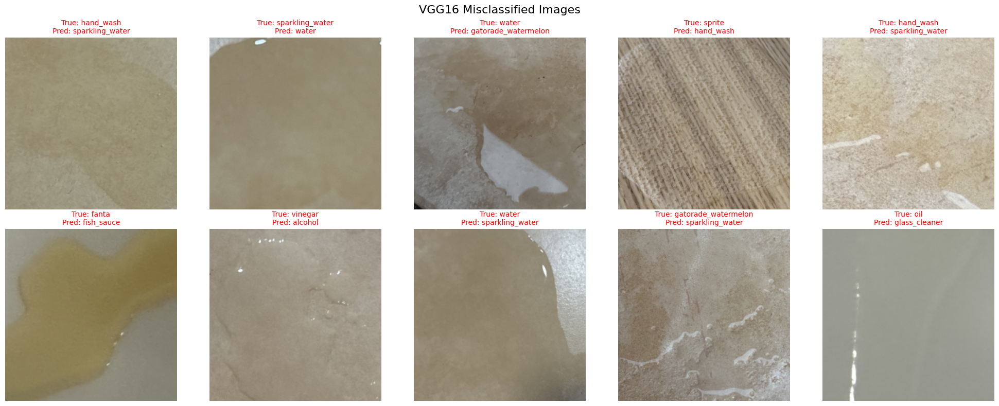
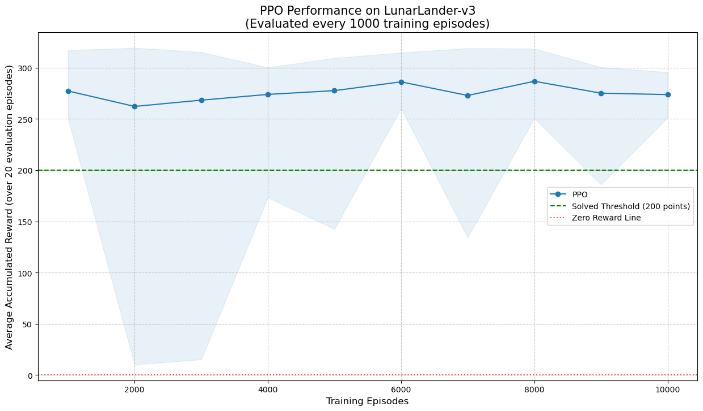

# Advanced Computer Vision and Action

This repository contains a portfolio of advanced projects from the COMP8430 unit at Macquarie University. These projects demonstrate a comprehensive skill set in computer vision, deep reinforcement learning, and the deployment of AI systems on physical hardware. The work progresses from rigorous model evaluation to the complete design and implementation of an autonomous robotics system.

## Table of Contents
1.  [**Project 1: Spill Identification & Autonomous Robot Reaction (Final Project)**](#project-1-spill-identification--autonomous-robot-reaction-final-project)
    -   Objective & Real-World Application
    -   Methodology & System Architecture
    -   Key Outcomes & Demonstration
2.  [**Project 2: Fine-Grained Aircraft Classification & Analysis**](#project-2-fine-grained-aircraft-classification--analysis)
    -   Objective & Core Challenge
    -   Methodology & Techniques
    -   Key Outcomes
3.  [**Project 3: Deep Reinforcement Learning for Gaming Environments**](#project-3-deep-reinforcement-learning-for-gaming-environments)
    -   Objective & Learning Paradigms
    -   Methodology & Environments
    -   Key Outcomes

---

## Project 1: Spill Identification & Autonomous Robot Reaction (Final Project)

### Objective & Real-World Application
This project's goal was to bridge the gap between a standalone computer vision model and a functional, autonomous robotic system. The system was designed to identify different types of domestic spills in real-time and execute specific motor actions based on the classification, simulating a practical application for a cleaning or disaster-response robot.

### Methodology & System Architecture
This end-to-end project involved a multi-stage development process:

1.  **Custom Dataset Creation:** A unique dataset of 21 domestic spill categories (e.g., Coke, Oil, Gatorade variants, Milk) was manually collected and annotated. This was done under varied lighting and on different surfaces to ensure the model could handle real-world visual diversity.

2.  **Model Development & Fine-Tuning (PyTorch):**
    *   A pre-trained **ResNet50** model was initially fine-tuned on the 21-class dataset.
    *   Advanced training techniques were employed, including **layer-wise learning rates** to preserve valuable low-level features while adapting high-level ones.
    *   A specialized 3-class model was created via **transfer learning** from the initial 21-class model, using a smaller dataset captured directly from the robot's camera to optimize performance for the specific deployment environment.

3.  **Robotics Integration (ROS2):**
    *   A Python-based ROS2 subscriber node (`capture_sub.py`) was developed to process the real-time image stream from the robot's camera (`/depth_cam/rgb/image_raw`).
    *   A core application node (`react.py`) was engineered to:
        *   Perform real-time inference using the loaded 3-class PyTorch model.
        *   Map classification outputs to specific behaviors (e.g., "Coke" -> move forward; "Gatorade Blue" -> move forward + turn left; "Gatored Red" -> move backward; "Uncertain" -> stop).
        *   Publish `geometry_msgs/Twist` messages to the `/cmd_vel` topic to control the robot's motors.

### Key Outcomes & Demonstration
- A fully functional, deployed system where a physical robot autonomously reacted to its environment based on visual input.
- The specialized 3-class model achieved **100% test accuracy** under lab conditions, validating the two-stage fine-tuning approach.
- This project demonstrates a complete "code-to-physical-action" pipeline, showcasing skills in applied AI, robotics, and system integration.

**Visualizing the training loss of 21 Categories Model:**

  

**Visualizing the training loss of fine-tuned 3 Categories Model:**

  

**Visualizing the training/validation loss and accuracy graphs of Phase 1-2 Experiment**

  

  

**Visualizing the samples of misclassified images in Phase 1-2 Experiment**

  

  

**Visualizing the learning curves graphs of Phase 2 Experiment**

  

**Visualizing the samples of misclassified images in Phase 2 Experiment**

  

---

## Project 2: Fine-Grained Aircraft Classification & Analysis

### Objective & Core Challenge
This project addressed the challenge of **Fine-Grained Visual Classification (FGVC)**, which requires distinguishing between highly similar sub-categories (e.g., different models of the same aircraft family). The goal was to systematically evaluate various deep learning techniques to find the optimal approach for the FGVC-Aircraft dataset (102 classes).

### Methodology & Techniques
- **Systematic Model Evaluation:** A rigorous comparison was conducted between **VGG16** and **ResNet50**, testing multiple fine-tuning strategies (e.g., full fine-tuning vs. freezing the backbone) and learning rate schedulers (`StepLR`, `CosineAnnealingLR`, `ReduceLROnPlateau`).
- **Data Augmentation:** The impact of strong data augmentation techniques, including `RandomResizedCrop`, `ColorJitter`, and `RandomErasing`, was analyzed and shown to be critical for model generalization.
- **Advanced CV Exploration:**
    - **Generative Adversarial Networks (GANs):** A **DCGAN** was implemented to generate synthetic aircraft images, exploring its potential for augmenting fine-grained datasets.
    - **Model Interpretability:** **DeepDream** was used to visualize the features learned by different convolutional layers of the ResNet-50 model, providing insight into what the model "sees" at different levels of abstraction.

### Key Outcomes
- The **fine-tuned ResNet50 model achieved a test accuracy of 84.85%**, significantly outperforming VGG16 and proving its architectural superiority for this task.
- The analysis concluded that a full fine-tuning approach combined with advanced data augmentation and an adaptive learning rate scheduler (`ReduceLROnPlateau`) was the most effective strategy.
- This project demonstrates a mature, scientific approach to model selection, training, and analysis.

**Example of DeepDream visualization on an aircraft image:**

  

---

## Project 3: Practical Reinforcement Learning

### Objective & Learning Paradigms
This project explored practical reinforcement learning by applying and comparing different algorithms across a range of environments, from simple grid worlds to complex, vision-based Atari games.

### Methodology & Environments
1.  **Q-Learning & Custom Environments:**
    *   Implemented the **Q-learning** algorithm from scratch to solve the "CliffWalking" environment.
    *   Designed and built a **custom `gymnasium` environment** that fully replicated the CliffWalking problem, demonstrating a fundamental understanding of the RL API and state-action-reward dynamics.
    *   Analyzed the effect of different **epsilon decay rates** on the exploration-exploitation tradeoff.

2.  **Policy-Based vs. Value-Based Methods:**
    *   Trained and compared **Deep Q-Network (DQN)** and **Proximal Policy Optimization (PPO)** agents from the Stable Baselines 3 library on the "LunarLander-v3" environment.
    *   Analyzed the results to highlight the differences in convergence speed, learning stability, and final performance between the two algorithmic families.

3.  **Learning from Raw Pixels:**
    *   Trained a PPO agent using a **`CnnPolicy`** on the Atari game "Riverraid" directly from pixel inputs.
    *   Systematically evaluated the impact of crucial preprocessing techniques for vision-based RL: **frame skipping** and **frame stacking**, demonstrating how they provide the agent with a sense of motion and reduce computational load.

### Key Outcomes
- Successfully solved all environments, with the **PPO agent consistently achieving near-optimal scores** on LunarLander and Riverraid.
- The analysis quantitatively demonstrated PPO's superior stability over DQN for the control tasks.
- Proved that temporal data preprocessing (frame stacking) is essential for effective learning from raw pixel inputs in dynamic environments, with the properly configured agent achieving a **~3.6x higher reward** than the non-preprocessed baseline.

**Performance comparison of Epsilon Decay Rate on Cliff Walking with Q-Learning:**

  

  

**Performance comparison of DQN vs. PPO on LunarLander-v3:**

  

  

**Performance comparison of DQN vs. PPO on LunarLander-v3:**

  

  

**Performance comparison of Frame Skip and Stack on pixel-based learning with RiverraidNoFrameSkip-v4 Gym Environment:**

  

  

**Performance comparison of Epsilon Decay Rate on Custom Cliff Walking Environment with Q-Learning:**

  

  

